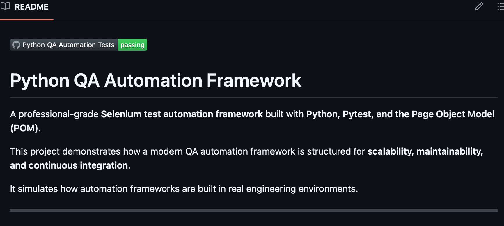
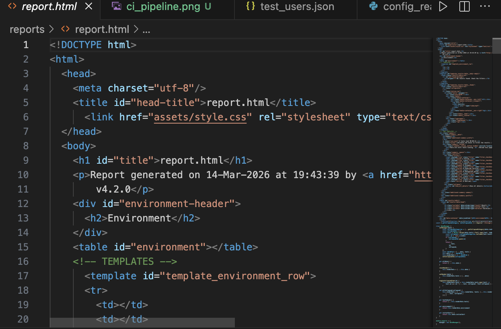

[](https://github.com/je80sand/python-qa-automation-framework/actions/workflows/ci.yml)

# Python QA Automation Framework

A professional-grade **Selenium test automation framework** built with **Python, Pytest, and the Page Object Model (POM)**.

This project demonstrates how a modern QA automation framework is structured for **scalability, maintainability, and continuous integration**.

It simulates how automation frameworks are built in real engineering environments.

---

# Framework Capabilities

This automation framework demonstrates modern QA engineering practices:

- Selenium WebDriver automation
- Page Object Model (POM)
- centralized configuration management
- reusable base page architecture
- automatic screenshots on test failure
- structured logging
- parallel test execution using pytest-xdist
- HTML test reporting
- GitHub Actions CI pipeline

These capabilities reflect how automation frameworks are designed in real production environments.

---

# Tech Stack

Python  
Pytest  
Selenium WebDriver  
pytest-xdist (parallel test execution)  
pytest-html (test reports)  
PyYAML (configuration management)  
GitHub Actions (CI/CD)

---

# Framework Design

The framework follows a layered automation architecture:

```
Tests
   │
   ▼
Page Objects
   │
   ▼
Base Page
   │
   ▼
Driver Factory
   │
   ▼
WebDriver (Selenium)
```

This architecture ensures:

- clean and readable tests
- reusable page actions
- centralized driver management
- scalable automation structure

---

# Project Architecture

The framework follows the **Page Object Model (POM)** design pattern.

```
python-qa-automation-framework
│
├── pages
│ ├── base_page.py
│ ├── login_page.py
│ └── search_page.py
│
├── tests
│ ├── test_login.py
│ └── test_search.py
│
├── utils
│ ├── config_reader.py
│ ├── driver_factory.py
│ ├── logger.py
│ └── screenshot_helper.py
│
├── config
│ └── settings.yaml
│
├── .github/workflows
│ └── ci.yml
│
├── requirements.txt
└── README.md
```

---

# Key Features

## Page Object Model

Each page in the application has its own class containing:

- locators
- actions
- reusable functions

Example:

```
login_page.py
```

Encapsulates login behavior so tests remain clean and maintainable.

---

## Parallel Test Execution

Tests run in parallel using:

```
pytest -n 2
```

Parallel execution significantly reduces execution time in larger test suites.

---

## Centralized Configuration

Framework settings are stored in:

```
config/settings.yaml
```

Example:

```
base_url: https://the-internet.herokuapp.com
browser: chrome
timeout: 10
```

This allows easy environment configuration.

---

## Logging

The framework includes structured logging for:

- test execution
- debugging
- CI diagnostics

Logs are generated automatically during test runs.

---

## Screenshots on Failure

If a test fails, the framework automatically captures a screenshot.

This helps quickly debug UI failures in CI environments.

---

## HTML Test Reports

Test reports are generated using:

```
pytest-html
```

Example command:

```
pytest -n 2 -v --html=report.html
```

This produces a visual report showing:

- passed tests
- failed tests
- execution time
- detailed test results

---

# Continuous Integration

This project uses **GitHub Actions** to automatically run tests on every push.

The CI pipeline performs:

- Python setup
- Chrome installation
- dependency installation
- parallel test execution
- test reporting

Workflow file:

```
.github/workflows/ci.yml
```

---

# Running Tests Locally

## Install dependencies

```
pip install -r requirements.txt
```

---

## Run tests

```
pytest -v
```

---

## Run tests in parallel

```
pytest -n 2 -v
```

---

## Generate HTML report

```
pytest -n 2 -v --html=report.html
```

---

# Example Test

Example login test:

```
def test_valid_login(driver):
    login_page = LoginPage(driver)

    login_page.login("tomsmith", "SuperSecretPassword!")
    assert "secure area" in driver.page_source.lower()
```

---

# Why This Framework Matters

Many Selenium examples online show only simple scripts.

This project demonstrates how **real automation frameworks are structured in professional environments**, including:

- scalable architecture
- reusable page objects
- centralized configuration
- CI integration
- parallel execution
- maintainability

---

# Future Improvements

Potential future enhancements:

- Dockerized test execution
- Allure reporting
- API test integration
- cross-browser testing
- test data management

---

# Author

Jose Sandoval

Premise Technician → Python Automation Engineer

GitHub  
https://github.com/je80sand

## CI Pipeline

The project includes a GitHub Actions pipeline that automatically runs tests on every push.



## HTML Test Report

The framework also generates a professional pytest HTML report for test results and debugging.

