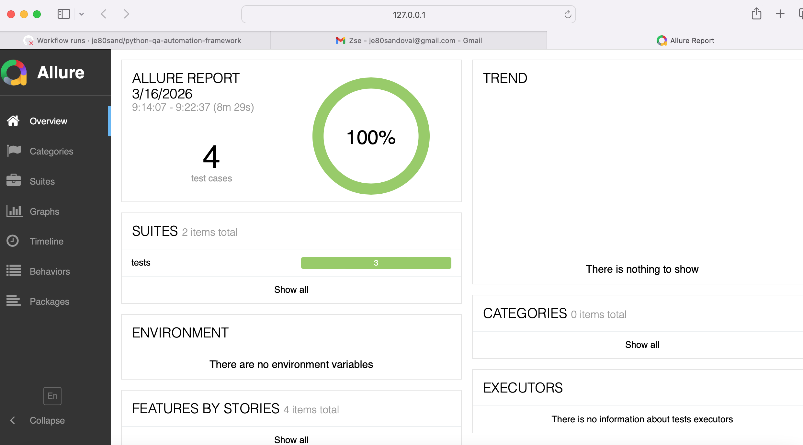

# Python QA Automation Framework


A professional-grade Selenium test automation framework built with **Python, Pytest, and the Page Object Model (POM)**.

This project demonstrates how a modern QA automation framework is structured for **scalability, maintainability, reporting, and continuous integration**.

It simulates how automation frameworks are built in real engineering environments.

---

## Framework Capabilities

This automation framework demonstrates modern QA engineering practices:

- Selenium WebDriver automation
- Page Object Model (POM)
- centralized configuration management
- reusable base page architecture
- automatic screenshots on test failure
- structured logging
- parallel test execution using pytest-xdist
- HTML test reporting
- Allure reporting
- GitHub Actions CI pipeline
- Makefile-based developer workflow

These capabilities reflect how automation frameworks are designed in real production environments.

---

## Tech Stack

Python  
Pytest  
Selenium WebDriver  
pytest-xdist  
pytest-html  
allure-pytest  
PyYAML  
GitHub Actions  
Makefile  

---

## Quick Start

Install dependencies:

```bash
pip install -r requirements.txt
```

Run all tests:

```bash
pytest -v
```

Run tests in parallel:

```bash
pytest -n 2 -v
```

Generate pytest HTML report:

```bash
pytest -n 2 -v --html=report.html
```

Run using Makefile:

```bash
make install
make test
make parallel
make report
make allure
make allure-report
make allure-open
```

---

## Framework Design

The framework follows a layered automation architecture:

```text
Tests
   │
   ▼
Page Objects
   │
   ▼
Base Page
   │
   ▼
Driver Factory
   │
   ▼
WebDriver (Selenium)
```

This architecture ensures:

- clean and readable tests
- reusable page actions
- centralized driver management
- scalable automation structure

---

## Project Architecture

The framework follows the **Page Object Model (POM)** design pattern.

```text
python-qa-automation-framework
│
├── pages
│ ├── base_page.py
│ ├── login_page.py
│ └── search_page.py
│
├── tests
│ ├── test_login.py
│ └── test_search.py
│
├── utils
│ ├── config_reader.py
│ ├── driver_factory.py
│ ├── logger.py
│ └── screenshot_helper.py
│
├── config
│ └── settings.yaml
│
├── docs
│ ├── ci_pipeline.png
│ ├── test_report.png
│ └── allure_report.png
│
├── .github/workflows
│ └── ci.yml
│
├── Makefile
├── requirements.txt
├── README.md
├── CONTRIBUTING.md
└── LICENSE
```

---

## Key Features

### Page Object Model

Each page in the application has its own class containing:

- locators
- actions
- reusable functions

Example:

```text
login_page.py
```

Encapsulates login behavior so tests remain clean and maintainable.

---

### Parallel Test Execution

Tests run in parallel using:

```bash
pytest -n 2
```

Parallel execution reduces runtime and reflects modern automation practices used in larger test suites.

---

### Centralized Configuration

Framework settings are stored in:

```text
config/settings.yaml
```

Example:

```yaml
base_url: https://the-internet.herokuapp.com
browser: chrome
timeout: 10
```

This allows easy environment configuration and cleaner test setup.

---

### Logging

The framework includes structured logging for:

- test execution
- debugging
- CI diagnostics

Logs are generated automatically during test runs.

---

### Screenshots on Failure

If a test fails, the framework automatically captures a screenshot.

This helps quickly debug UI failures in both local and CI environments.

---

## Reporting

### Pytest HTML Report

The framework supports professional HTML reports using `pytest-html`.

Example command:

```bash
pytest -n 2 -v --html=report.html
```

This produces a visual report showing:

- passed tests
- failed tests
- execution time
- detailed results

### Allure Report

The framework also supports **Allure reporting**, which provides a more advanced test dashboard.

Generate Allure results:

```bash
make allure
```

Generate the Allure dashboard:

```bash
make allure-report
```

Open the dashboard:

```bash
make allure-open
```

This provides a more advanced reporting view with:

- suites
- categories
- timeline
- behaviors
- trend visibility
- structured test result navigation

---

## Continuous Integration

This project uses **GitHub Actions** to automatically run tests on every push.

The CI pipeline performs:

- Python setup
- Chrome installation
- dependency installation
- automated test execution
- reporting support

Workflow file:

```text
.github/workflows/ci.yml
```

---

## Example Test

Example login test:

```python
def test_valid_login(driver):
    login_page = LoginPage(driver)
    login_page.login("tomsmith", "SuperSecretPassword!")
    assert "secure area" in driver.page_source.lower()
```

---

## CI Pipeline

The project includes a GitHub Actions pipeline that automatically runs tests on every push.


---

## HTML Test Report

The framework generates a professional pytest HTML report for test results and debugging.


---

## Allure Dashboard

The framework also supports Allure reporting for advanced result visualization.



---

## Developer Workflow

This project includes a `Makefile` to standardize common developer commands.

Available targets:

```bash
make install
make test
make parallel
make report
make allure
make allure-report
make allure-open
make clean
```

This improves usability and reflects a more professional engineering workflow.

---

## Why This Framework Matters

Many Selenium examples online show only basic scripts.

This project demonstrates how **real automation frameworks are structured in professional environments**, including:

- scalable architecture
- reusable page objects
- centralized configuration
- CI integration
- parallel execution
- professional reporting
- maintainability

---

## Future Improvements

Potential future enhancements:

- API automation integration
- Dockerized execution
- cross-browser testing
- environment-specific configuration
- test data factories
- richer CI artifacts

---

## Author

**Jose Sandoval**  
Premise Technician → Python Automation Engineer

GitHub: **je80sand**